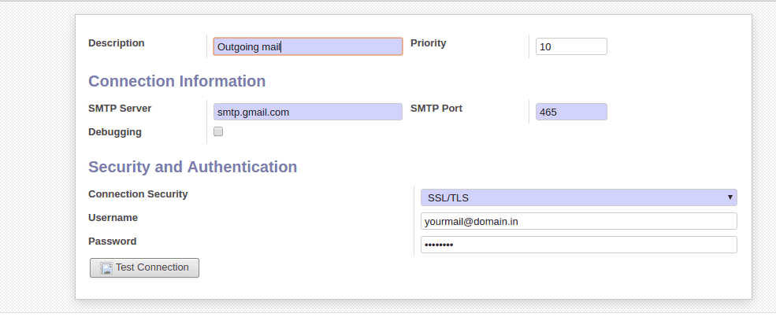

# Installation
# Configuration
>For configuration, follow this steps:
>1. Settings - Technical - Email - Outgoing Mail Servers.
>2. Register custom Otgoing Mail Service .
>Give field values as shown in the above screenshot. Provide the following details for Gmail SMTP: 
>   * **SMTP Server**: smtp.gmail.com
>   * **Connection Security**: SSL/TLS
>   * **Username**: Your gmail account
>   * **Password**: App Password of your email account. This would be generated in Google Setting. [Click here for help](https://support.google.com/mail/answer/185833?hl=en)
>   * **Priority**: The lower the number higher the priority
>   * **SMTP Port**: The port of your SMTP server. `465`

# Usage
# Troubleshooting